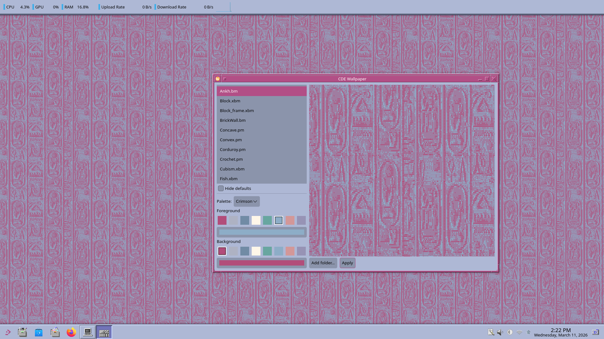

# cde-wallpaper



A Rust/GTK4 wallpaper picker for Wayland that reads authentic CDE (Common Desktop Environment) wallpaper files (`.xbm`, `.xpm`) and applies them via KDE Plasma's D-Bus API.

## Features

- Parses original CDE `.xbm` (X BitMap) and `.xpm` (X PixMap) wallpaper files
- Tiled rendering for bitmap patterns; scaled rendering for full-screen XPM images
- Built-in CDE color palettes with foreground/background color pickers
- Live preview before applying
- Sets wallpaper on KDE Plasma via D-Bus (`org.kde.plasmashell`)
- Config persisted to `~/.config/cde-wallpaper/config.toml`

## Requirements

- Wayland compositor (tested on KDE Plasma 6)
- GTK 4.12+
- D-Bus session (for KDE wallpaper apply)
- CDE wallpaper files (`.xbm` / `.xpm`) — default set included (see below)

## Dependencies

```toml
gtk4 = "0.9"       # GUI + GDK texture
zbus = "5"         # D-Bus (KDE PlasmaShell)
image = "0.25"     # PNG rendering
serde + toml       # Config serialization
anyhow             # Error handling
```

## Building

```bash
cargo build --release
```

## Running

```bash
cargo run --release
```

A default set of CDE wallpapers is embedded in the binary and shown on startup. Optionally click **Add folder…** to include your own wallpaper directory (files appear above the built-in defaults). Use the **Hide defaults** checkbox to hide the embedded set. Select a wallpaper, choose foreground/background colors from the CDE palette or a custom color picker, preview it, then click **Apply**.

## How It Works

1. **Parser** — reads `.xbm` (1-bit bitmap) and `.xpm` (indexed color) formats
2. **Renderer** — tiles bitmaps across the screen resolution; scales select XPM images (Concave, Convex, SkyDark, SkyLight) to fill
3. **GUI** — GTK4 window with file list, CDE palette swatches, live preview
4. **Apply** — renders to a temporary PNG, then calls KDE Plasma's `evaluateScript` D-Bus method to set it as the wallpaper

## CDE Palettes

The built-in palette list mirrors the original CDE palette set (Broica, Cactus, Default, Desert, EarthTones, Galactic, GrassyMeadow, Ivory, Maple, Monsoon, Ocean, Pumpkin, Sandstone, Slate, Spring, Sulphur, Sunshine, Tropical, Tundra, Wheat).

## Bundled Wallpapers

The default wallpaper files embedded in this binary (`.bm`, `.xbm`, `.pm`, `.xpm` files in `assets/wallpapers/`) originate from the **Common Desktop Environment (CDE)**, which is open-source software licensed under the **GNU Lesser General Public License v2 (LGPL-2)**. These files were not created by the author of this project. Source: [CDE on SourceForge](https://sourceforge.net/projects/cdesktopenv/).

The color palettes are also derived from CDE and are not original works of this project's author.

## License

MIT — see [LICENSE](LICENSE)
